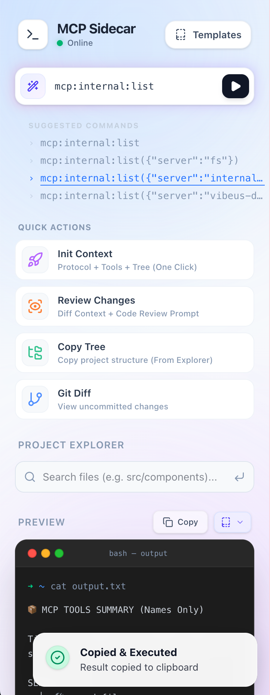
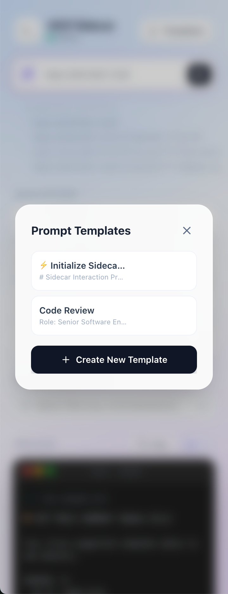

# MCP Sidecar

> 让网页版 AI 对话框（DeepSeek, ChatGPT, Gemini）拥有本地 Agent 能力。

这是一个基于 **MCP (Model Context Protocol)** 的开发者工具，包含 Chrome 插件前端和 Node.js 本地后端。它能通过 Sidebar 快速将本地文件、Git 变更等上下文投递给 AI，并管理常用的 Prompt 模板。

## ✨ 主要功能

- **⚡️ 快捷动作 (Quick Actions)**：一键获取 `Git Diff` 或项目变更，自动拼接提示词并复制。
- **📂 项目资源管理器 (Project Explorer)**：
- 支持读取本地文件内容。
- 智能路径补全（Tab 键）。
- 自动识别文件夹（输入 `src` 回车自动列出目录）。

- **📝 Prompt 管理**：内置模板管理，支持动态参数。
- **🔌 扩展性**：通过 `mcp.config.json` 接入任意标准 MCP Server（文件系统、Git、数据库等）。

## 🛠 前置要求

- Node.js >= 18
- pnpm

## 🚀 快速开始

### 1. 安装依赖

```bash
git clone git@github.com:dreamhuan/mcp-sidecar.git
cd mcp-sidecar
pnpm install

```

### 2. 项目配置

修改根目录的 `.env` 文件：

```ini
# 后端服务端口
PORT=8080

# 你的目标项目根目录（绝对路径）
PROJECT_ROOT=/absolute/path/to/target-project

# 前端 API 地址
VITE_API_URL=http://localhost:8080

```

修改 `mcp.config.json` (配置 MCP 服务)：

```json
{
  "fs": {
    "command": "npx",
    "args": ["-y", "@modelcontextprotocol/server-filesystem", "${PROJECT_ROOT}"]
  }
}
```

### 3. 一键运行

```bash
pnpm start

```

> 该命令会自动执行：
>
> 1. 构建前端插件 (`apps/extension`) 输出到 `dist`。
> 2. 启动后端服务 (`apps/server`) 监听 8080 端口。

### 4. 加载插件

1. 打开 Chrome 浏览器访问 `chrome://extensions/`。
2. 开启右上角的 **"开发者模式" (Developer mode)**。
3. 点击 **"加载已解压的扩展程序" (Load unpacked)**。
4. 选择本项目下的 `apps/extension/dist` 目录。
5. 在任意网页点击侧边栏图标即可唤起。

---

## 💻 开发指南

如果你需要修改源码，可以使用以下命令：

| 命令         | 说明                                                                                                            |
| ------------ | --------------------------------------------------------------------------------------------------------------- |
| `pnpm dev`   | **UI 调试模式**。同时启动后端和前端开发服务器 (Vite)，可在浏览器 `localhost:5173` 快速调试 UI。                 |
| `pnpm watch` | **插件调试模式**。后端正常运行，前端处于 `build --watch` 模式。修改前端代码后只需在 Chrome 扩展页点击刷新即可。 |
| `pnpm build` | **仅编译**。对前后端进行 TypeScript 类型检查，并构建前端生产包。                                                |

## 🤝 常见问题

**Q: 为什么需要运行 Node 后端？**  
A: 浏览器插件受限于沙箱安全策略，无法直接读取你的本地文件系统或执行 Git 命令。Node 后端作为中转站（Sidecar），负责通过 MCP 协议与本地系统交互。

**Q: 文件搜索怎么用？**  
A: 在 Input 框输入路径（如 `src/App.tsx`）回车即可读取内容。输入目录名（如 `src`）回车可查看文件列表。支持按 `Tab` 键补全路径。

## UI

<div style="display:inline-flex">


</div>
